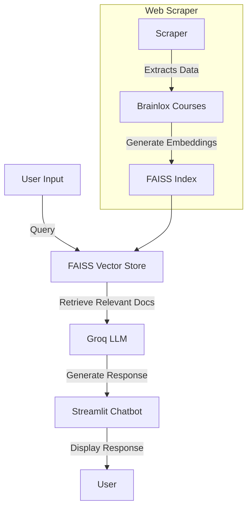

# 🧠 AI Chatbot with FAISS and Groq LLM  

Deployed on Streamlit: https://brainlox-chatbot-88ltxwczonehkjjtysct7r.streamlit.app/

## 📌 Overview  
This project implements an AI-powered chatbot using **Groq LLM** for intelligent responses and **FAISS (Facebook AI Similarity Search)** for efficient vector-based retrieval. The chatbot is built using **Streamlit**, supports embeddings for improved context retrieval, and integrates a web scraper for course data from Brainlox.  

## 🚀 Key Features  
- **Conversational AI**: Uses **Groq LLM** for generating human-like responses.  
- **Vector Search with FAISS**: Stores and retrieves embeddings efficiently.  
- **Web Scraper**: Extracts course data from Brainlox to enhance chatbot knowledge.  
- **Retrieval-Augmented Generation (RAG)**: Combines document retrieval with LLM for accurate responses.  
- **Embeddings with Sentence Transformers**: Efficient document representation for retrieval.  

---

## 🔍 Key Concepts  
- **LLM (Large Language Model)**: Groq LLM generates responses based on retrieved information.  
- **FAISS (Vector Search)**: Stores embeddings for efficient retrieval.  
- **Retrieval-Augmented Generation (RAG)**: Enhances chatbot answers with retrieved context.  
- **Web Scraping**: Automates the collection of course data from Brainlox.  

---

## 📊 Flow Diagram  


---

## ⚙️ Installation  

### Prerequisites  
- Python 3.8+  
- pip installed  

### Steps  
1️⃣ **Clone the Repository**  
```sh
git clone https://github.com/Hemangini21/Brainlox-Chatbot.git
cd chatbot
```

2️⃣ **Create a Virtual Environment (Optional but Recommended)**  
```sh
python -m venv env
source env/bin/activate  # On Mac/Linux
env\Scripts\activate     # On Windows
```

3️⃣ **Install Dependencies**  
```sh
pip install -r requirements.txt
```

4️⃣ **Set Up Environment Variables**  
Create a `.env` file in the project root and add:  
```ini
GROK_LLM_API_KEY=your_api_key_here
VECTOR_DB_PATH=vector_store.faiss
```

---

## 📌 Usage  

### Start the Chatbot  
```sh
streamlit run app.py
```
- Type your messages and receive AI-generated responses.  
- If the FAISS index does not exist, it will be created automatically.  

### Run the Web Scraper  
```sh
python scraper.py
```
- Scrapes Brainlox courses and saves the data.  

### Generate Embeddings for FAISS  
```sh
python embeddings.py
```
- Converts scraped text into embeddings and stores in FAISS.  

---

## 📜 Code Structure  

```
📂 chatbot_project/
│── 📜 app.py             # Streamlit chatbot UI
│── 📜 chatbot.py         # Chatbot logic with FAISS and Groq LLM
│── 📜 scraper.py         # Web scraper for Brainlox courses
│── 📜 embeddings.py      # FAISS embeddings generator
│── 📜 requirements.txt   # Dependencies
│── 📜 README.md          # Documentation
│── 📜 .env               # Environment variables
```

---


This README ensures a clear structure with all necessary details. Let me know if you'd like any modifications! 😊
